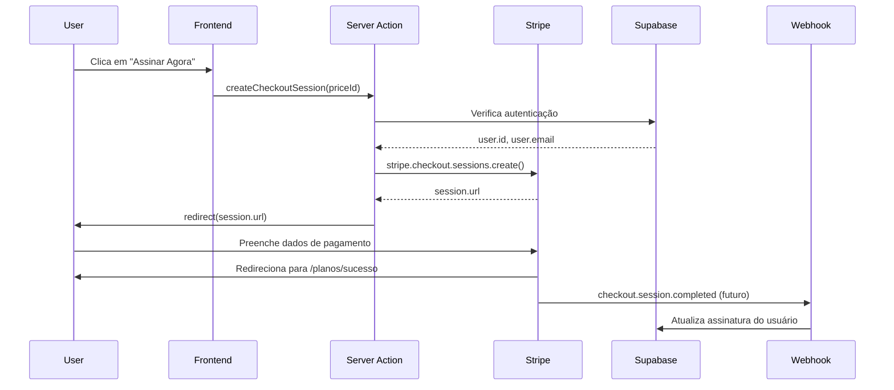

# 💳 Integração do Stripe - Ybybid

Este documento descreve a integração completa do Stripe para processar pagamentos de assinaturas no Ybybid.

---

## 📋 Índice

1. [Visão Geral](#visão-geral)
2. [Configuração](#configuração)
3. [Arquitetura](#arquitetura)
4. [Fluxo de Pagamento](#fluxo-de-pagamento)
5. [Testando a Integração](#testando-a-integração)
6. [Webhooks](#webhooks)
7. [Troubleshooting](#troubleshooting)

---

## 🎯 Visão Geral

A integração do Stripe no Ybybid utiliza:

- **Stripe Checkout**: Interface de pagamento hospedada pelo Stripe
- **Subscriptions**: Sistema de assinaturas recorrentes
- **Server Actions**: Criação segura de sessões de checkout no servidor
- **Webhooks**: Processamento de eventos assíncronos (futuro)

---

## ⚙️ Configuração

### 1. Variáveis de Ambiente

No arquivo `.env`, configure:

```env
# Chaves da API do Stripe
NEXT_PUBLIC_STRIPE_PUBLISHABLE_KEY=pk_test_...
STRIPE_SECRET_KEY=sk_test_...
STRIPE_WEBHOOK_SECRET=whsec_... (opcional por enquanto)

# IDs dos Produtos
NEXT_PUBLIC_STRIPE_PRODUCT_MONTHLY=prod_TDZTmujpR72rd2
NEXT_PUBLIC_STRIPE_PRICE_MONTHLY=price_1SH8KmF9OeA0H1YRmZLPGYC2
```

### 2. Obter as Chaves do Stripe

#### Publishable Key e Secret Key:
```
🔗 https://dashboard.stripe.com/test/apikeys

1. Copie "Publishable key" → NEXT_PUBLIC_STRIPE_PUBLISHABLE_KEY
2. Clique em "Reveal" e copie "Secret key" → STRIPE_SECRET_KEY
```

#### Webhook Secret (para produção):
```
🔗 https://dashboard.stripe.com/test/webhooks

1. Clique em "Add endpoint"
2. URL: https://seu-dominio.com/api/webhooks/stripe
3. Eventos:
   - checkout.session.completed
   - customer.subscription.created
   - customer.subscription.updated
   - customer.subscription.deleted
4. Copie o "Signing secret" → STRIPE_WEBHOOK_SECRET
```

---

## 🏗️ Arquitetura

### Arquivos Principais

```
src/
├── lib/
│   └── stripe.ts                    # Cliente Stripe (servidor)
├── app/
│   └── planos/
│       ├── page.tsx                 # Página de planos
│       ├── SubscribeButton.tsx      # Botão de assinatura (client)
│       ├── actions.ts               # Server Actions (checkout)
│       └── sucesso/
│           └── page.tsx             # Página de sucesso
```

### 1. **src/lib/stripe.ts**
```typescript
import Stripe from 'stripe';

export const stripe = new Stripe(process.env.STRIPE_SECRET_KEY, {
  apiVersion: '2024-12-18.acacia',
  typescript: true,
});
```
- Inicializa o cliente Stripe no servidor
- Usa a chave secreta (nunca exposta ao cliente)

### 2. **src/app/planos/actions.ts**
```typescript
'use server';

export async function createCheckoutSession(priceId: string) {
  // 1. Verifica autenticação
  const { user } = await supabase.auth.getUser();
  
  // 2. Cria sessão de checkout
  const session = await stripe.checkout.sessions.create({
    customer_email: user.email,
    client_reference_id: user.id,
    line_items: [{ price: priceId, quantity: 1 }],
    mode: 'subscription',
    success_url: '${URL}/planos/sucesso?session_id={CHECKOUT_SESSION_ID}',
    cancel_url: '${URL}/planos?canceled=true',
  });
  
  // 3. Redireciona para checkout
  redirect(session.url);
}
```
- **Server Action** segura
- Requer autenticação
- Cria sessão de checkout
- Redireciona para o Stripe

### 3. **src/app/planos/SubscribeButton.tsx**
```typescript
'use client';

export function SubscribeButton({ priceId, cta }) {
  const handleClick = async () => {
    await createCheckoutSession(priceId);
  };
  
  return <Button onClick={handleClick}>{cta}</Button>;
}
```
- **Client Component** interativo
- Chama a Server Action
- Exibe loading state

### 4. **src/app/planos/page.tsx**
```typescript
export default function PlanosPage() {
  const planos = [
    {
      nome: 'Mensal',
      preco: 119,
      priceId: process.env.NEXT_PUBLIC_STRIPE_PRICE_MONTHLY,
      // ...
    },
  ];
  
  return (
    <SubscribeButton 
      priceId={plano.priceId} 
      cta="Assinar Agora" 
    />
  );
}
```
- Lista os planos disponíveis
- Usa `SubscribeButton` para cada plano

---

## 🔄 Fluxo de Pagamento



### Passo a Passo

1. **Usuário clica em "Assinar Agora"**
   - Se não estiver autenticado → redireciona para `/entrar`
   - Se autenticado → continua

2. **Server Action cria sessão de checkout**
   - Valida autenticação com Supabase
   - Cria sessão no Stripe com:
     - Email do usuário
     - ID do usuário (para webhook futuro)
     - Price ID do plano escolhido
     - URLs de sucesso e cancelamento

3. **Usuário é redirecionado para o Stripe**
   - Interface de pagamento segura do Stripe
   - Suporta cartão de crédito, PIX, etc.

4. **Após pagamento bem-sucedido**
   - Stripe redireciona para `/planos/sucesso`
   - Exibe mensagem de confirmação

5. **Se cancelar**
   - Stripe redireciona para `/planos?canceled=true`
   - Exibe alerta de cancelamento

---

## 🧪 Testando a Integração

### 1. Certifique-se de ter as variáveis configuradas

```bash
# Verifique se as variáveis estão no .env
grep STRIPE .env
```

### 2. Reinicie o servidor Next.js

```bash
npm run dev
```

### 3. Teste o fluxo completo

#### **Teste 1: Plano Gratuito**
1. Acesse: http://localhost:3000/planos
2. Clique em "Começar Grátis"
3. ✅ Deve redirecionar para `/registrar`

#### **Teste 2: Plano Mensal (sem login)**
1. Acesse: http://localhost:3000/planos
2. Clique em "Assinar Agora" no plano mensal
3. ✅ Deve redirecionar para `/entrar`

#### **Teste 3: Plano Mensal (com login)**
1. Faça login: http://localhost:3000/entrar
2. Acesse: http://localhost:3000/planos
3. Clique em "Assinar Agora"
4. ✅ Deve redirecionar para o Stripe Checkout
5. Use um **cartão de teste**:
   ```
   Número: 4242 4242 4242 4242
   Data: Qualquer data futura (ex: 12/25)
   CVC: Qualquer 3 dígitos (ex: 123)
   ```
6. Preencha nome e email
7. Clique em "Subscribe"
8. ✅ Deve redirecionar para `/planos/sucesso`

#### **Teste 4: Cancelamento**
1. Na tela de checkout do Stripe, clique em "← Voltar"
2. ✅ Deve voltar para `/planos` com mensagem de cancelamento

### 4. Cartões de Teste do Stripe

| Cenário | Número do Cartão |
|---------|------------------|
| ✅ Sucesso | `4242 4242 4242 4242` |
| ❌ Falha genérica | `4000 0000 0000 0002` |
| ❌ Cartão recusado | `4000 0000 0000 9995` |
| 🔒 Requer autenticação | `4000 0025 0000 3155` |

---

## 🔔 Webhooks (Próximo Passo)

Os webhooks permitem que o Stripe notifique seu servidor sobre eventos importantes.

### Eventos a Implementar

1. **checkout.session.completed**
   - Quando o pagamento é concluído com sucesso
   - Ativar assinatura do usuário no banco de dados

2. **customer.subscription.created**
   - Quando uma nova assinatura é criada
   - Criar registro de assinatura

3. **customer.subscription.updated**
   - Quando uma assinatura é atualizada (upgrade/downgrade)
   - Atualizar registro de assinatura

4. **customer.subscription.deleted**
   - Quando uma assinatura é cancelada
   - Desativar acesso premium

### Estrutura do Webhook (a implementar)

```typescript
// src/app/api/webhooks/stripe/route.ts
export async function POST(request: Request) {
  const signature = request.headers.get('stripe-signature');
  const body = await request.text();
  
  const event = stripe.webhooks.constructEvent(
    body,
    signature,
    process.env.STRIPE_WEBHOOK_SECRET
  );
  
  switch (event.type) {
    case 'checkout.session.completed':
      // Ativar assinatura do usuário
      break;
    case 'customer.subscription.deleted':
      // Desativar assinatura do usuário
      break;
  }
  
  return Response.json({ received: true });
}
```

---

## 🔍 Troubleshooting

### Erro: "STRIPE_SECRET_KEY não está definida"

**Solução:**
```bash
# Verifique se a variável está no .env
cat .env | grep STRIPE_SECRET_KEY

# Se estiver vazia, adicione sua chave
# STRIPE_SECRET_KEY=sk_test_...
```

### Erro: "Redirect não funcionando"

**Causa:** Stripe redirect só funciona em Server Actions (não em Client Components)

**Solução:** Certifique-se de que:
- `createCheckoutSession` está em um arquivo com `'use server'`
- Está sendo chamada de um Client Component

### Botão "Assinar" não faz nada

**Possíveis causas:**
1. `priceId` está undefined
2. Erro na autenticação
3. Chaves do Stripe inválidas

**Debug:**
```typescript
// No SubscribeButton.tsx
const handleClick = async () => {
  console.log('PriceId:', priceId); // Deve mostrar price_xxx
  try {
    await createCheckoutSession(priceId);
  } catch (error) {
    console.error('Erro:', error);
  }
};
```

### Redireciona para /entrar mesmo estando logado

**Causa:** Token de autenticação pode estar expirado

**Solução:**
1. Faça logout
2. Faça login novamente
3. Tente assinar novamente

---

## 📚 Recursos Adicionais

- [Documentação do Stripe Checkout](https://stripe.com/docs/checkout)
- [Stripe Testing Guide](https://stripe.com/docs/testing)
- [Stripe Webhooks](https://stripe.com/docs/webhooks)
- [Next.js Server Actions](https://nextjs.org/docs/app/building-your-application/data-fetching/server-actions-and-mutations)

---

## ✅ Checklist de Implementação

### Fase 1: Básico (✅ Completo)
- [x] Configurar variáveis de ambiente
- [x] Instalar bibliotecas do Stripe
- [x] Criar cliente Stripe no servidor
- [x] Criar Server Action para checkout
- [x] Criar botão de assinatura (client)
- [x] Integrar na página de planos
- [x] Criar página de sucesso
- [x] Testar com cartões de teste

### Fase 2: Webhooks (⏳ Próximo)
- [ ] Criar endpoint de webhook
- [ ] Verificar assinatura do webhook
- [ ] Processar evento `checkout.session.completed`
- [ ] Processar evento `customer.subscription.deleted`
- [ ] Atualizar status de assinatura no Supabase
- [ ] Testar webhooks com Stripe CLI

### Fase 3: Gestão de Assinatura (🔮 Futuro)
- [ ] Portal do cliente (Stripe Customer Portal)
- [ ] Cancelamento de assinatura
- [ ] Upgrade/Downgrade de planos
- [ ] Visualizar faturas
- [ ] Histórico de pagamentos

---

**Criado em**: 2025-10-11  
**Última atualização**: 2025-10-11  
**Status**: ✅ Integração básica completa


